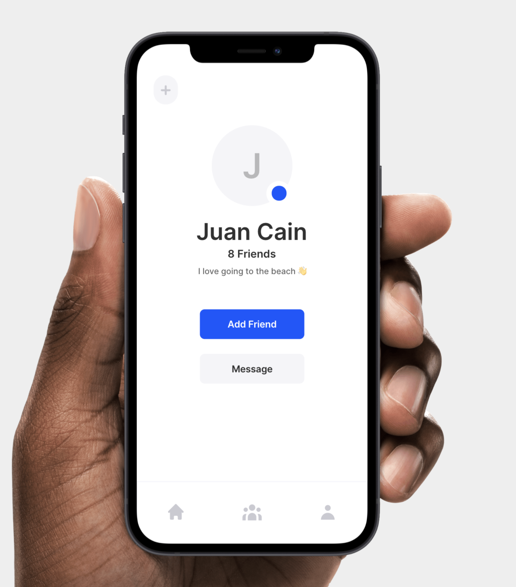
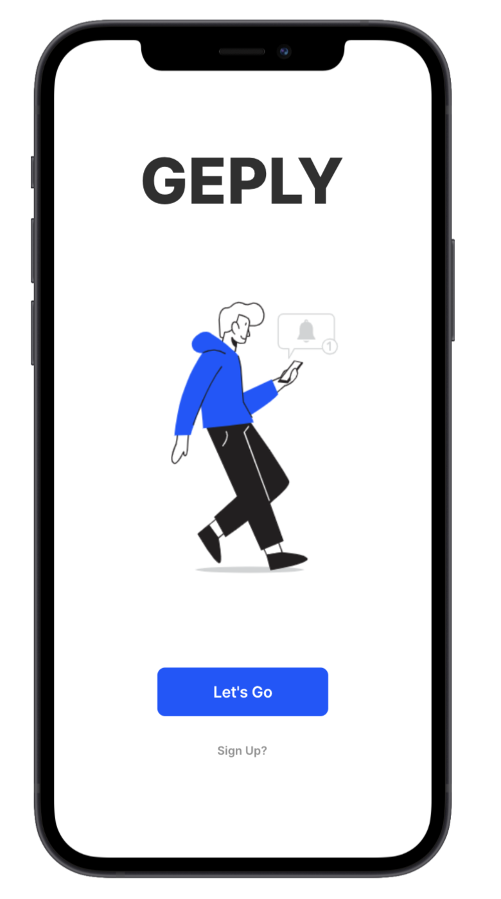
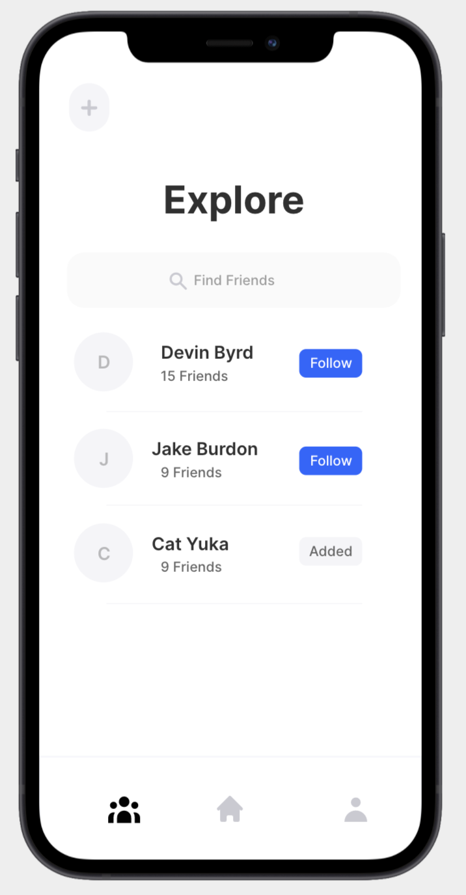

# Geply

A social media application built with React and MongoDB

## Deployment

My Application has been deployed with Heroku here |
[Geply](https://geply.herokuapp.com/)

## Why make this?

It was created to connect people and capture moments by allowing users to share their photos. I also wanted to push the boundaries with what I could do with a full stack app. 🚀

## My goal

I decided to follow my design instincts and went for something modern and sleek. I wanted the user interface to be as simple as possible. My main challenge was figuring out how to save images to my database by setting it up with the cloud.

## Profile Page

The design of the users profile page  

## Login Page

The first thing users see when they open the app  

## Explore Page

Here you can find your friends  

## End note

I hope you enjoyed going through my full-stack application 👏
